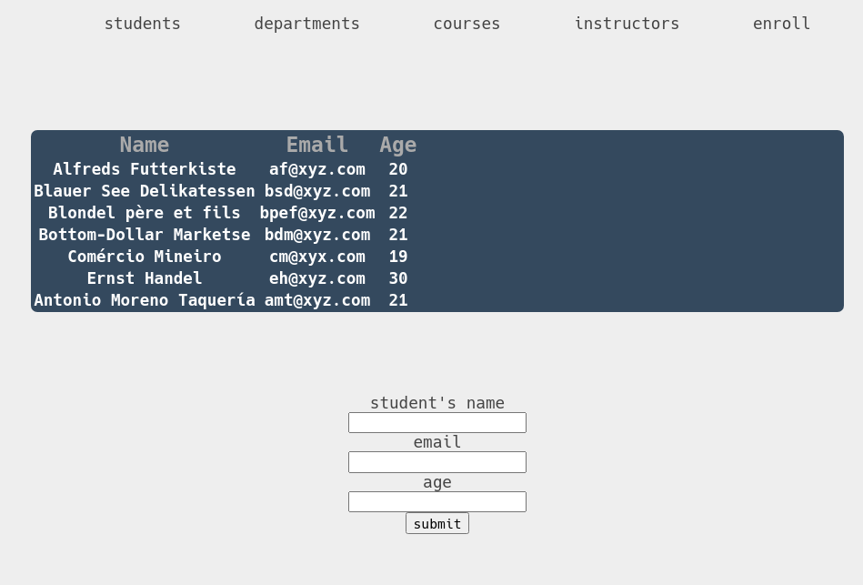

## Project for DBMS

submitted by : 

| roll number | name | 
|-------------|------|
|  185513     | dikshit kaushal |
|  185514     | ankita  |
|  185515     | shivang upadhyay |
|  185515     | pinki |


### problem statement

```
Colleges have multiple departments where every department offers many courses. These
departments have a head (HOD) and various instructors. Even though there are many instructors,
one instructor can only work in one department. As you can see the organization structure of a
college is quite complicated and requires a lot of effort to manage.
In this database project, you can build a solution to tackle this problem. It would store all this
information about the college and its departments. However, the information we’ve discussed
above isn’t sufficient for a college. We need to mention the courses as well.
A course can have only one instructor, but an instructor can have multiple classes. You’d need to
add this information to the database system as well. You can make this project more advanced by
adding the course enrollment information.
You can add the enrollment information of the students as to how many students have taken a
particular course.
```


### our approch 

```
 we made an website that handle the college database , with given constraint . 
 list of the model that we use 
```

| model | use | 
|-------|-----|
| student | basic info for a student | 
| department |  head id and name | 
| instructor |  basic info for an instructor | 
| course |  course id  , department that offers it and associated instructor  | 
| enroll |  course id and student id  |


### tables defination

``` 
currently we use the following sql file for the table generation  , and following is the defination 
for the tables 
```
```sql
create table departments (
  id bigserial primary key not null  ,
  name text not null ,
  hod_id int not null 
);

create table courses (
  name text not null  ,
  id bigserial primary key not null , 
  instructor_id integer not null ,
  department_id int not null 
);

create table instructors (
  name text not null , 
  email text not null , 
  age int not null , 
  id bigserial primary key not null 
);
create table students (
  name text not null , 
  age int not null  , 
  email text not null , 
  id bigserial primary key not null 
);

create table enroll (
  student_id int not null , 
  course_id int not null 
);


```

### backend 

``` 
stack for backend stack is go + sqlc + postgres + docker 
the handlers are written in go . with sqlc for codegen  based 
on sql given in schema files. docker handles the postgres@5432 . 
```

###  frontend 

```
for frontend we are just using plain js + html + css stack .
```



